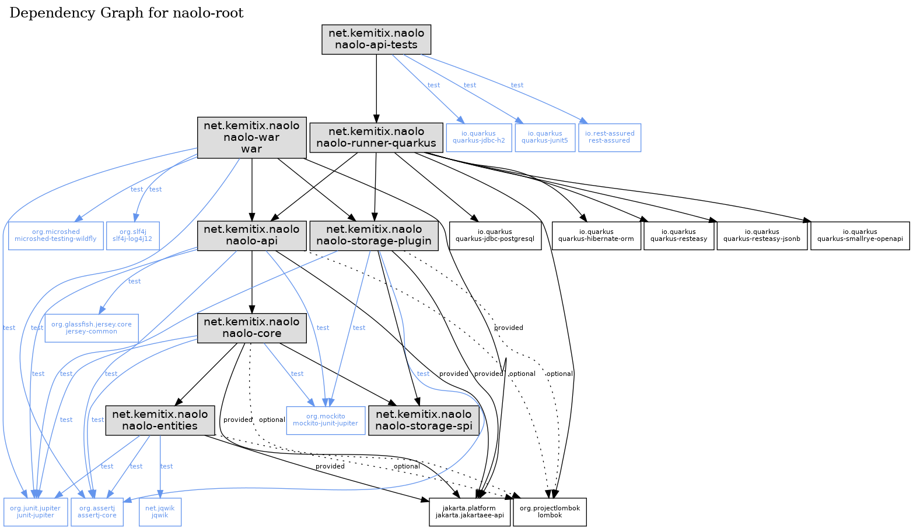
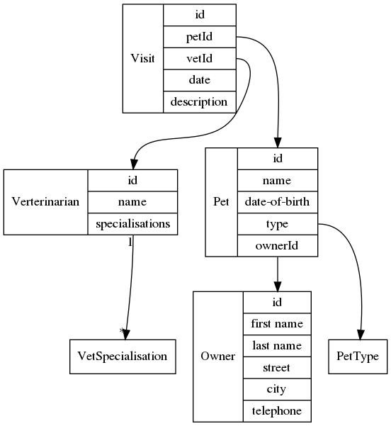

# Naolo

A Clean Architecture Example of the Pet Clinic using Jakarata EE 8.
  
Runtime and Integration Testing is provided using Quarkus.

Based loosely on the original 
[PetClinic](https://github.com/spring-projects/spring-petclinic) sample 
application from Spring.

## Purpose/Caveats

This project is both a work-in-progress and an experimental test-bed where I
play with the ideas of Clean Architecture and build my knowledge of Jakarta EE,
coming from a Spring background.

At this point, I wouldn't advocate using anything here are any suggestion of
how to do 'it'. I'm liable to refactor anything simply to explore how something
might work. As such, there may be some over-engineering as a result.

## Dependencies

Naolo uses Jarakta-EE 8.0 and as such the main business modules have that
as their only dependency. The exception is Lombok, because I want to avoid the 
noise of having lots of boiler-plate to maintain and parse for no reason.

The runtime and integration tests are based on Quarkus.

> `make graphs`

## Pet Clinic

Rather that attempt to implement the full website from the original example, I
will be focusing on providing the services as a REST endpoint, upon which
another application/service could be used to provide the website.

## Domain Entities

The PetClinic has the following domain:

> `make domain`

## Dev

* Quarkus Dev: port 8080
* Npm Dev: port 3000

To start the Quarkus run-time in dev mode and the webui module on port 3000:
`make start-dev` This will launch Quarkus in the background in dev-mode. Changes
 to Java code will be picked up automatically. I will also launch a copy of the
 webui on port 3000, where changes to the files in `webui/src/main/web` will be
 picked up up automatically. Press Ctrl-C to stop the webui, then
 `make stop-dev` will shutdown the Quarkus server.

See the `Makefile` for other options.

## Run

To start the server in standalone dev-mode: `make install run-dev`

To start the server as a native binary: `make native run-native`
